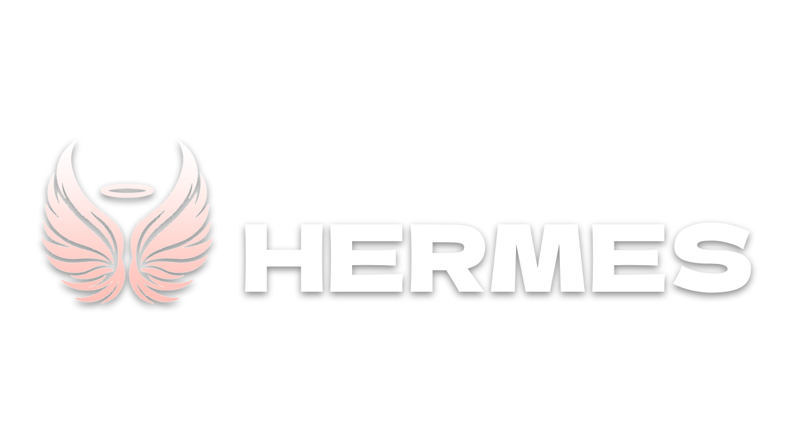

[](https://forthebadge.com)
[](https://forthebadge.com)
[](https://forthebadge.com)

**Note this is only the source code behind the plugin. The UI will not be available in this repo**

Hermes is a powerful and lightweight tool designed to streamline the synchronization of assets from public repositories. This tool enables developers to seamlessly import various assets, including scripts, modules, or components created by other developers. With Hermes, collaboration becomes more efficient as it facilitates the sharing and integration of valuable resources across different projects.

## Features

- **Effortless Asset Sync:** Hermes simplifies the process of syncing assets from public repositories, making it easy for developers to access and integrate resources.

- **Supports Various Asset Types:** Whether it's scripts, modules, or specific components, Hermes accommodates a wide range of asset types, promoting flexibility in development workflows.

- **Version Control:** Benefit from version control features to manage and track changes to assets, ensuring a seamless and organized collaboration process.

- **Lightweight and Fast:** Hermes is designed to be lightweight and fast, minimizing the impact on your development environment while maximizing productivity.

## Setup

1.  Setup the [Hermes Server Backend](https://github.com/jun-ro/HermesServer) on whatever hosting service you desire, you can even locally host it. 
2.  Download the .rbxm file from [Releases](https://github.com/jun-ro/Hermes/releases/tag/release) and save it in your ```C:\Users\[username]\AppData\Local\Roblox\Plugins``` folder.
3.  Make sure you have your own storage repo for all your assets. You can find out how to set one up [here](https://github.com/jun-ro/ExampleHermesStorage)


## Contact

- [Discord](https://discord.com/users/629745194920837120)

## Credits

- [Me](https://github.com/jun-ro)